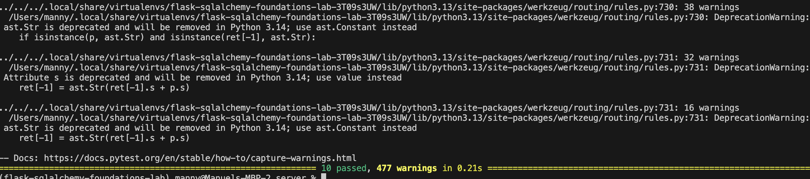

# Flask-SQLAlchemy Earthquake API

This project is a Flask backend API for storing and querying earthquake data.

It uses SQLAlchemy for database management and returns JSON responses for easy frontend use.

---

## Features

- Store earthquake data in a database
- Query earthquakes by ID
- Query earthquakes by minimum magnitude
- Database migrations and seed data
- Fully tested with Pytest

---

## Setup

```console
pipenv install --dev
pipenv shell
cd server
export FLASK_APP=app.py
export FLASK_RUN_PORT=5555
Run & Test
flask run --port 5555
pytest
API Routes
GET /earthquakes/<id>
GET /earthquakes/magnitude/<magnitude>

 ## Screenshot

